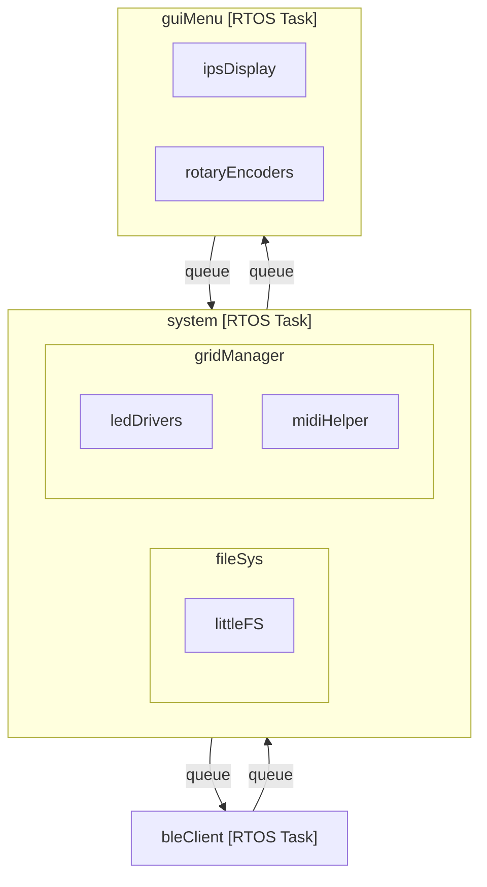

# Firmware architecture overview.
**NOTE: This project is ongoing**

The firmware is made up of a set of modules which are stored in the "components" directory. 

**Module descriptions**
(Intended as a brief overview, see the code for more details).

- **system**: The system module acts as the top level controller for the system as a whole.
- **gridManager**: [submodule of 'system'] Manages the grid data-structure, which holds all midi event data.
- **midiHelper**: Provides generic midi file processing helper functions.
- **guiMenu**: Provides a bespoke GUI menu system.
- **ipsDisplay**: Low-level driver for SPI controlled IPS display, which provides UI.
- **rotaryEncoders**: Low-level driver for two quadrature rotary encoders (each with SPST switch).
- **switchMatrix**: The switch matrix component detection of sequencer grid input events.
- **ledDrivers**: Low-level driver for four I2C controlled LP5862 RBG LED drivers, which provide additional UI for the sequencer input grid.
- **fileSys**: Handles all file system read/write operations. A port of littleFS provides the file system.
- **bleClient**: A Bluetooth low-energy GATT client which sends midi data to the GATT server during grid playback.

**The diagram below provides an overview of how the component modules are arranged into RTOS tasks and associated submodules**
    

